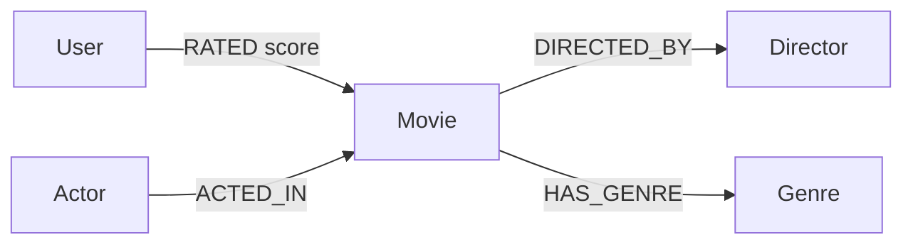
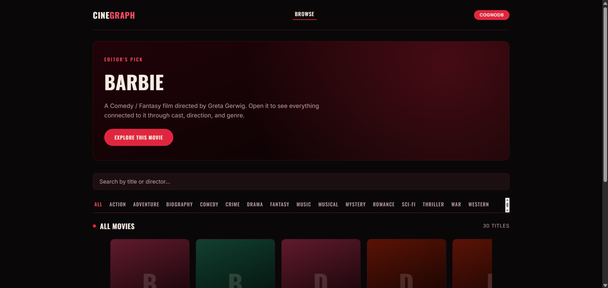
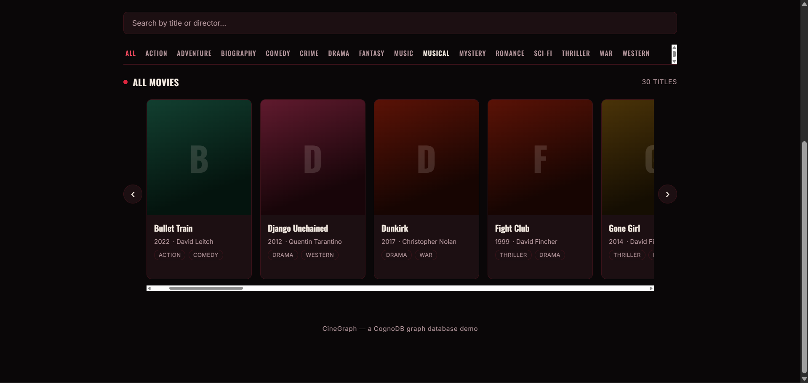
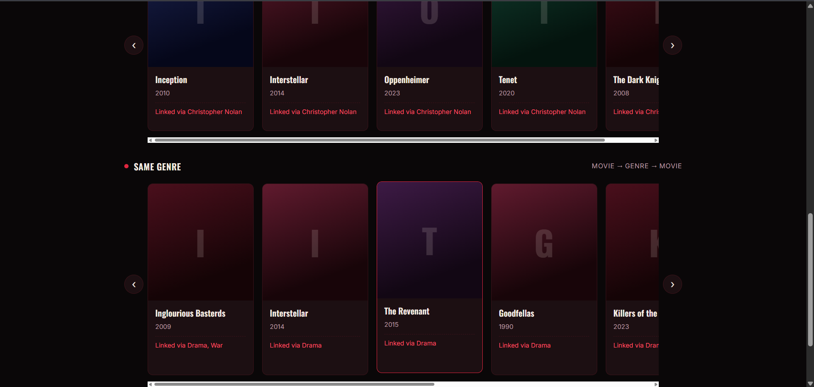

<div align="center">

# 🎬 CineGraph

**A movie discovery app powered by a graph database.**

Browse movies → see what's connected through cast, director, or genre → explore an actor's second-degree co-star network.

[](https://nodejs.org)
[](https://react.dev)
[](https://opencypher.org)
[](https://console.cognodb.com)

*Built for the Wexa AI take-home assignment (CognoDB Assignment 2)*

</div>

---

## 📋 Contents

- [Why a graph database?](#-why-a-graph-database)
- [How the app works](#-how-the-app-works)
- [Data model](#-data-model)
- [The required non-trivial queries](#-the-required-non-trivial-queries)
- [A note on CognoDB's Cypher engine](#-a-note-on-cognodbs-cypher-engine)
- [Project structure](#-project-structure)
- [Setup & run](#-setup--run)
- [Deployment](#-deployment)
- [Error handling](#-error-handling)
- [Screenshots](#-screenshots)

---

## 🕸️ Why a graph database?

Movie discovery is fundamentally about **connections between things**, not rows in a table.

| Question | As a graph traversal | As SQL |
|---|---|---|
| *"What else is like this movie?"* | One 2-hop pattern per relationship: `Movie → Actor/Director/Genre → OtherMovie` | A join through a separate bridge table for each relationship (`movie_actors`, `movie_directors`, `movie_genres`), with no single natural way to combine them |
| *"Who is this actor indirectly connected to?"* | A direct pattern match two hops out, with an exclusion clause | A recursive CTE plus an anti-join |
| *"Why was this connected?"* | Falls out of the traversal for free — the path was already walked to find the result | Requires re-querying to reconstruct the reasoning afterward |

Relational databases resolve relationships via joins computed at query time. Graph databases store the relationship itself as a first-class edge, so multi-hop questions stay fast and simple to express as the model grows — which is exactly the shape of a discovery problem.

---

## 🖱️ How the app works

**Browse → Movie → Actor** is the whole flow:

1. **Browse** a searchable, genre-filterable grid of 30 seeded movies.
2. **Click a movie** to see its cast, director, genres, and three separate rows of connected movies:
   - 🎭 **Same cast** — movies sharing an actor with this one
   - 🎬 **Same director** — movies by the same director
   - 🏷️ **Same genre** — movies sharing a genre
3. **Click any actor** to see their **second-degree co-star network** — people they've never directly worked with, but who share two or more co-stars with them.

---

## 🗺️ Data model



| Node | Properties |
|---|---|
| `User` | `id`, `name` |
| `Movie` | `id`, `title`, `year` |
| `Actor` | `name` |
| `Director` | `name` |
| `Genre` | `name` |

`RATED` carries the `score` property (1–5) on the **edge**, since a rating is a fact about the *pairing*, not either node alone.

**Seed data:** 30 movies · ~40 actors · ~10 directors · ~10 genres · 5 users · 25 ratings — enough for a real, overlapping graph, comfortably inside the CognoDB free-tier (c0) limits.

> **Note:** `User` and `RATED` data is seeded and still queryable via the API (`GET /api/users`, `GET /api/recommend/:userId` — a 3-hop collaborative-filtering traversal: shared high-rated movies → taste-twin users → their other high-rated movies). It powered an earlier version of the UI ("For You") that was removed in favor of the simpler, movie-first flow above, but the endpoint and query remain in the codebase as a demonstration of a third multi-hop pattern.

---

## 🔍 The required non-trivial queries

| # | Query | Endpoint | File |
|---|---|---|---|
| 1 | **Multi-hop "connected movies"** — three parallel 2-hop traversals (shared actor / director / genre), returned as separate labeled categories rather than one blended score | `GET /api/movies/:id/similar` | `server/src/routes/movies.js` |
| 2 | **Relationally-awkward co-star query** — actors sharing 2+ co-stars with someone who they've *never* worked with directly | `GET /api/recommend/co-stars/:actorName` | `server/src/routes/recommend.js` |
| 3 | **Bonus 3-hop query** — collaborative filtering (see note above) | `GET /api/recommend/:userId` | `server/src/routes/recommend.js` |

All queries use **parameterised Cypher** via the official `neo4j-driver` — no string concatenation anywhere in the codebase.

---

## ⚠️ A note on CognoDB's Cypher engine

Two commonly-used modern Cypher constructs behaved unreliably on CognoDB's engine and had to be rewritten:

- **`NOT EXISTS { pattern }`** (subquery syntax) threw a hard syntax error → replaced with plain `NOT (pattern)` inline negation.
- Even plain `NOT (pattern)` and `OPTIONAL MATCH ... WHERE x IS NULL` **silently returned zero rows** in the collaborative-filtering query's "already rated" exclusion — despite being valid openCypher and working fine in the co-star query one route over. Diagnosed by testing the query incrementally in CognoDB's own query console, clause by clause, until the exact failing fragment was isolated.
- **The fix:** pre-compute the exclusion set as a plain list (`collect(seen.id)`) and filter with `NOT x.id IN list` instead of any pattern-negation form. More verbose, but reliable everywhere it was tested — the safer default on this engine.

---

## 📁 Project structure

<details>
<summary>Click to expand full file tree</summary>

```text
cinegraph/
├── server/                          Express API
│   ├── .env.example
│   └── src/
│       ├── db.js                    CognoDB connection + query helper + error handling
│       ├── seedData.js              Raw seed dataset (movies, actors, users, ratings)
│       ├── seed.js                  Loads seedData into CognoDB
│       ├── server.js                Express app entrypoint
│       └── routes/
│           ├── movies.js            Browse, detail, 3-category similar-movies query
│           ├── users.js             User list + ratings (bonus endpoint only)
│           └── recommend.js         Co-star network + collaborative-filtering bonus query
│
└── client/                          React (Vite) frontend
    ├── .env.example
    ├── index.html
    └── src/
        ├── App.jsx                  Router: list → movie detail → actor network
        ├── api.js                   Thin fetch wrapper around the backend API
        ├── index.css                Design system (colors, layout, components)
        └── components/
            ├── MovieBrowse.jsx      Search, genre pills, spotlight
            ├── MovieDetail.jsx      Cast + "Same cast/director/genre" rows
            ├── CoStarExplorer.jsx   Second-degree co-star search
            ├── MovieCard.jsx        Poster-style card
            ├── PosterRow.jsx        Horizontal scroll carousel
            └── StateBlock.jsx       Loading/empty/error states
```

</details>

**Quick tour, by layer:**

| Layer | Key files | What it does |
|---|---|---|
| 🗄️ Database access | `server/src/db.js` | Owns the CognoDB connection, exposes a `runQuery()` helper every route uses |
| 🔌 API routes | `server/src/routes/*.js` | One file per resource — movies, users, recommendations |
| 🌱 Seeding | `server/src/seed*.js` | Raw data + the script that loads it via parameterised Cypher |
| 🖼️ Pages | `client/src/components/Movie*.jsx`, `CoStarExplorer.jsx` | The three screens: browse, detail, actor network |
| 🧩 Shared UI | `MovieCard.jsx`, `PosterRow.jsx`, `StateBlock.jsx` | Reused building blocks (a card, a carousel, loading/empty/error states) |


---

## ⚙️ Setup & run

### 1. Create your CognoDB instance

1. Sign up at [console.cognodb.com](https://console.cognodb.com/signup) — free, no card required.
2. Create a free **(c0)** instance in your nearest region.
3. Copy the `bolt+s://...` URI and the generated password for user `cognodb` — **the password is shown once**.

### 2. Configure and seed the backend

```bash
cd server
cp .env.example .env
# edit .env with your NEO4J_URI / NEO4J_USER / NEO4J_PASSWORD

npm install
npm run seed      # loads the seed dataset into CognoDB
npm run dev       # starts the API on http://localhost:4000
```

### 3. Run the frontend

```bash
cd client
npm install
npm run dev       # http://localhost:5173, proxies /api to the backend
```

### 4. Try it

- Open `http://localhost:5173`
- Browse the movie grid, filter by genre, or search
- Click a movie → see its cast and three rows of connected movies
- Click any actor → see their second-degree co-star network

---

## 🚀 Deployment

| Layer | Where | Notes |
|---|---|---|
| Backend | Render / Railway (free tier) | Set the same three env vars |
| Frontend | Vercel / Netlify | Set `VITE_API_URL` to your deployed backend URL |

---

## 🛡️ Error handling

If CognoDB is unreachable, the API logs the failure at boot, still starts, and every route returns a `503` with a clear message rather than crashing. The frontend surfaces this as a dedicated error state with a retry button on every panel.

---
## 🌐 Live Demo
https://cine-graph-oiijxskyr-assessments1.vercel.app/

## 🎬 Screen Recording
Click below to watch a 2 minute walkthrough of CineGraph:
👉 **[▶️ Watch the CineGraph Demo](https://drive.google.com/file/d/1ptC5gL8NvXPZ_Z8mhpFJSJ0nB4gM4jY2/view?usp=sharing)**
---
## 📸 Screenshots 

Home page 


Search by movie title/director & genre pills


Selected movie


Movies of same Cast and same Director


Movies of same Genre


Actor Network

