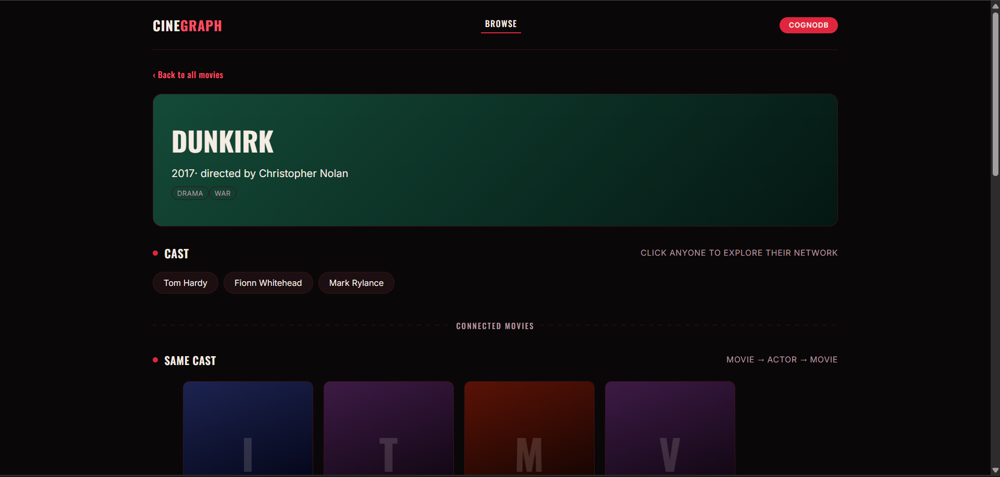
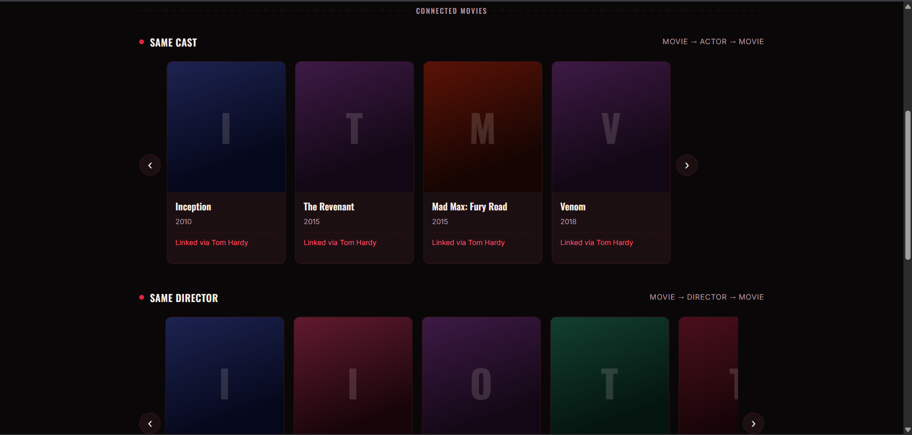

# CineGraph

A movie discovery app backed by **CognoDB** (a managed graph database
speaking openCypher over Bolt). Browse movies, open one to see what's
connected to it through shared cast, director, or genre, then click any
actor to see who else they're indirectly linked to through a co-star
network.

> Built for the Wexa AI take-home assignment (CognoDB Assignment 2).

---

## Why a graph database?

Movie discovery is fundamentally about **connections between things**, not
rows in a table:

- "What else is like this movie?" means walking outward from one movie
  through its actors, director, and genres to find other movies that share
  them — a 2-hop pattern (`Movie → Actor → OtherMovie`, and the same shape
  for Director and Genre) run three separate ways. In SQL, each of those
  needs its own join through a bridge table (`movie_actors`,
  `movie_directors`, `movie_genres`), and there's no single natural way to
  express "connected through any of these" without several joins or unions.
- "Who is this actor indirectly connected to?" — actors who share 2+
  co-stars with someone but have never worked with them directly — needs a
  **second-degree relationship search with an exclusion clause**. In SQL
  that's a recursive CTE plus an anti-join; in Cypher it's a direct pattern
  match two hops out.
- Every "connected via" explanation on screen falls out of the traversal
  itself, because the path was already walked to find the result — no
  extra queries needed to reconstruct the reasoning afterward.

Relational databases resolve relationships via joins computed at query
time; graph databases store the relationship itself as a first-class edge,
so these multi-hop questions stay fast and simple to express as the model
grows more connected — which is exactly the shape of a discovery problem.

## How the app works

**Browse → Movie → Actor** is the whole flow:

1. **Browse** a searchable, genre-filterable grid of 30 seeded movies.
2. Click one to see its **cast, director, genres**, and three separate
   rows of connected movies:
   - **Same cast** — movies sharing an actor with this one
   - **Same director** — movies by the same director
   - **Same genre** — movies sharing a genre
3. Click **any actor** in the cast to see their **second-degree co-star
   network**: people they've never directly worked with, but who share two
   or more co-stars with them.

## Data model

```
(:User)-[:RATED {score}]->(:Movie)
(:Actor)-[:ACTED_IN]->(:Movie)
(:Movie)-[:DIRECTED_BY]->(:Director)
(:Movie)-[:HAS_GENRE]->(:Genre)
```
    RATED {score: 1-5}

(User) ───────────────────► (Movie) ──HAS_GENRE──► (Genre)
▲
│ ACTED_IN
│
(Actor)
                          (Movie) ──DIRECTED_BY──► (Director)
                          
- **User** `{id, name}`
- **Movie** `{id, title, year}`
- **Actor** `{name}`
- **Director** `{name}`
- **Genre** `{name}`
- **RATED** carries the `score` property (1–5) on the edge, since a rating
  is a fact about the *pairing*, not either node alone.

Seed data: 30 movies, ~40 actors, ~10 directors, ~10 genres, 5 users, 25
ratings — enough for a real, overlapping graph, comfortably inside the
CognoDB free-tier (c0) limits.

> **Note:** the `User` and `RATED` data is seeded and still queryable via
> the API (`GET /api/users`, `GET /api/recommend/:userId` — a 3-hop
> collaborative-filtering traversal: shared high-rated movies → taste-twin
> users → their other high-rated movies). It powered an earlier version of
> the UI ("For You") that was removed in favor of the simpler,
> movie-first flow described above, but the endpoint and query are still in
> the codebase as a demonstration of a third multi-hop pattern.

## The required non-trivial queries

1. **Multi-hop "connected movies"** (`GET /api/movies/:id/similar`) — three
   parallel 2-hop traversals, one each for shared actor, director, and
   genre, returned as separate labeled categories rather than blended into
   one ambiguous score. See `server/src/routes/movies.js`.
2. **Relationally-awkward co-star query** (`GET
   /api/recommend/co-stars/:actorName`) — finds actors who share 2+
   co-stars with a given actor but have *never* worked with them directly.
   Needs a recursive CTE + anti-join in SQL; one pattern match in Cypher.
   See `server/src/routes/recommend.js`.
3. **Bonus 3-hop query** (`GET /api/recommend/:userId`) — collaborative
   filtering (see note above), same file.

All queries use parameterised Cypher via the official `neo4j-driver` — no
string concatenation anywhere in the codebase.

### A note on CognoDB's Cypher engine

While building this, two commonly-used modern Cypher constructs behaved
unreliably on CognoDB's engine and had to be rewritten:

- `NOT EXISTS { pattern }` (subquery syntax) — threw a hard syntax error.
  Replaced with plain `NOT (pattern)` inline negation.
- Even plain `NOT (pattern)` and `OPTIONAL MATCH ... WHERE x IS NULL`
  silently returned zero rows in one query (the "already rated" exclusion
  in the collaborative-filtering query), despite being valid openCypher and
  working fine in the co-star query one route over. Diagnosed by testing
  the query incrementally in CognoDB's own query console, clause by
  clause, until the exact failing fragment was isolated.
- The fix: pre-compute the exclusion set as a plain list
  (`collect(seen.id)`) and filter with `NOT x.id IN list` instead of any
  pattern-negation form. More verbose, but reliable everywhere it was
  tested — this is the safer default on this engine.

## Project structure
cinegraph/
├── server/ Express API
│ ├── src/
│ │ ├── db.js CognoDB connection + query helper + error handling
│ │ ├── seedData.js Raw seed dataset (movies, actors, users, ratings)
│ │ ├── seed.js Loads seedData into CognoDB
│ │ ├── server.js Express app entrypoint
│ │ └── routes/
│ │ ├── movies.js Browse, detail, and the 3-category similar-movies query
│ │ ├── users.js User list + ratings (used by the bonus endpoint only)
│ │ └── recommend.js Co-star network + collaborative-filtering bonus query
│ └── .env.example
└── client/ React (Vite) frontend
└── src/
├── App.jsx Router: list -> movie detail -> actor network
├── api.js
└── components/
├── MovieBrowse.jsx Search, genre pills, spotlight
├── MovieDetail.jsx Cast, "Same cast/director/genre" rows
├── CoStarExplorer.jsx Second-degree co-star search
├── MovieCard.jsx Poster-style card
├── PosterRow.jsx Horizontal scroll carousel
└── StateBlock.jsx Loading/empty/error states


## Setup & run

### 1. Create your CognoDB instance

1. Sign up at [console.cognodb.com](https://console.cognodb.com/signup)
   (free, no card).
2. Create a free (c0) instance in your nearest region.
3. Copy the `bolt+s://...` URI and the generated password for user
   `cognodb` — **the password is shown once**.

### 2. Configure and seed the backend

```bash
cd server
cp .env.example .env
# edit .env with your NEO4J_URI / NEO4J_USER / NEO4J_PASSWORD
npm install
npm run seed     # loads the seed dataset into CognoDB
npm run dev       # starts the API on http://localhost:4000
```

### 3. Run the frontend

```bash
cd client
npm install
npm run dev        # http://localhost:5173, proxies /api to the backend
```

### 4. Try it

- Open `http://localhost:5173`.
- Browse the movie grid, filter by genre, or search.
- Click a movie to see its cast and three rows of connected movies.
- Click any actor to see their second-degree co-star network.

## Deployment

- **Backend**: deploy `server/` to Render or Railway (free tier). Set the
  same three env vars there.
- **Frontend**: deploy `client/` to Vercel or Netlify. Set `VITE_API_URL`
  to your deployed backend URL.

**Live demo:** _add your hosted link here before submitting_
**Screen recording:** _add your Loom/OBS link here before submitting_

## Error handling

If CognoDB is unreachable, the API logs the failure at boot, still starts,
and every route returns a `503` with a clear message rather than crashing.
The frontend surfaces this as a dedicated error state with a retry button
on every panel.

## Screenshots

_Add screenshots here before submitting: the browse grid, a movie detail
page with its three connected-movie rows, and the co-star explorer._





